[English](README.en.md) | **简体中文**

<picture>
  <source media="(max-width: 640px) and (prefers-color-scheme: dark)" srcset="assets/presentation/hero-mobile-dark.svg">
  <source media="(max-width: 640px)" srcset="assets/presentation/hero-mobile-light.svg">
  <source media="(prefers-color-scheme: dark)" srcset="assets/presentation/hero-dark.svg">
  
</picture>

**在已接入的工具分发点检查能力 profile，拒绝越界回调并记录允许与拒绝的原因。**

`v0.5.0` · `Python 3.12+` · [Apache-2.0](LICENSE)

[Website](https://capsule.lei6393.com) · [Demo record](docs/demo-results.json)

## 为什么使用

当宿主允许技能调用工具时，声明中的权限范围需要被实际执行路径检查。Capsule 提供宿主 adapter 和 Interposer，让调用方在进入真实工具回调前执行工具、路径和网络规则。安装 Python 包本身不会自动接管所有 Agent。

## 架构

<picture>
  <source media="(max-width: 640px) and (prefers-color-scheme: dark)" srcset="assets/presentation/architecture-mobile-dark.svg">
  <source media="(max-width: 640px)" srcset="assets/presentation/architecture-mobile-light.svg">
  <source media="(prefers-color-scheme: dark)" srcset="assets/presentation/architecture-dark.svg">
  
</picture>

host adapter 将工具事件转换成 CallRequest；policy.decide 按工具允许集、路径 deny、读写范围和网络 host 依次判定；Interposer 在拒绝时先记录并抛 CapabilityViolation，允许时才调用被包装函数。TrapLog 支持内存或 JSONL，CLI 可查看报告。

关键执行边界在 [interpose.py](capsule/interpose.py)，映射与 shell 意图解析在 [hosts/claude_code.py](capsule/hosts/claude_code.py)。路径规则为词法匹配，不能等同于内核沙箱。

## 安装

需要 Python 3.12+。下面只调用模拟 host callback，不执行任何文件、shell 或网络动作。

```bash
git clone https://github.com/SuperMarioYL/capsule.git
cd capsule
python3 -m venv .venv
source .venv/bin/activate
python -m pip install -e .
```

## 快速开始

真实 guard_tool_use 在 network-deny 与 readonly 两个 profile 下检查三个请求，仅允许 Read 回调运行。它验证回调级拒绝边界，没有连接真实 Agent 或验证系统调用隔离。

```bash
python examples/presentation_demo.py network-deny
python examples/presentation_demo.py readonly
```

完整请求、回调和计数在 [examples/presentation_demo.py](examples/presentation_demo.py)，两个 YAML profile 均随仓库提供。

## 使用

check -p FILE 校验 profile，init 创建初始配置，run 可回放技能声明的 capsule-calls。接入真实宿主时，必须将工具分发经过 adapter.guard_tool_use；未经过此入口的调用不受它控制。report 可读取 trap log，--json 给脚本使用。

## 实际 Demo

<picture>
  <source media="(max-width: 640px) and (prefers-color-scheme: dark)" srcset="assets/presentation/process-mobile-dark.svg">
  <source media="(max-width: 640px)" srcset="assets/presentation/process-mobile-light.svg">
  <source media="(prefers-color-scheme: dark)" srcset="assets/presentation/process-dark.svg">
  
</picture>

### 网络拒绝 profile

一个允许回调、两个拒绝，记录具体规则。

```text
$ python examples/presentation_demo.py network-deny
{
  "profile": "network-deny",
  "decisions": [
    {
      "tool": "Read",
      "decision": "allow"
    },
    {
      "tool": "Write",
      "decision": "deny",
      "rule": "path-not-in-profile"
    },
    {
      "tool": "WebFetch",
      "decision": "deny",
      "rule": "network-not-in-profile"
    }
  ],
  "callbacks_executed": [
    "Read"
  ],
  "summary": {
    "allowed": 1,
    "blocked": 2,
    "total": 3
  }
}
```

### 只读 profile

在更窄工具允许集下重复检查相同请求。

```text
$ python examples/presentation_demo.py readonly
{
  "profile": "readonly",
  "decisions": [
    {
      "tool": "Read",
      "decision": "allow"
    },
    {
      "tool": "Write",
      "decision": "deny",
      "rule": "tool-not-in-profile"
    },
    {
      "tool": "WebFetch",
      "decision": "deny",
      "rule": "tool-not-in-profile"
    }
  ],
  "callbacks_executed": [
    "Read"
  ],
  "summary": {
    "allowed": 1,
    "blocked": 2,
    "total": 3
  }
}
```

## 能力与接入

<picture>
  <source media="(max-width: 640px) and (prefers-color-scheme: dark)" srcset="assets/presentation/integrations-mobile-dark.svg">
  <source media="(max-width: 640px)" srcset="assets/presentation/integrations-mobile-light.svg">
  <source media="(prefers-color-scheme: dark)" srcset="assets/presentation/integrations-dark.svg">
  
</picture>

Capsule 的拦截能力来自调用者主动包住 dispatcher，而非透明接管机器。保留原始 trap log 有助于复查，但日志不是所有未插桩动作的完整审计。


## 配置

profile 包含 skill、default: deny、tools、paths.read/write/deny 和 network.allow。显式 deny 优先；网络 allow 可使用 host 匹配。相对路径需要明确 base_dir；CLI run 按工作目录锚定。允许 shell 会扩大解析边界，需理解有限的命令意图识别。

## 路线图与范围

当前提供工具级策略、宿主 adapter、初始化、回放和报告。更多宿主与托管策略控制面属于后续方向；内核 seccomp-bpf 未实现，也没有已上线的托管套餐。

- 工具级策略不是内核 seccomp、容器或系统级沙箱。
- 未接入的调用不受控制，shell 意图解析也不是完整 shell 语义。
- 本次只验证模拟 callback 的执行边界。

## 许可证

[Apache-2.0](LICENSE)
